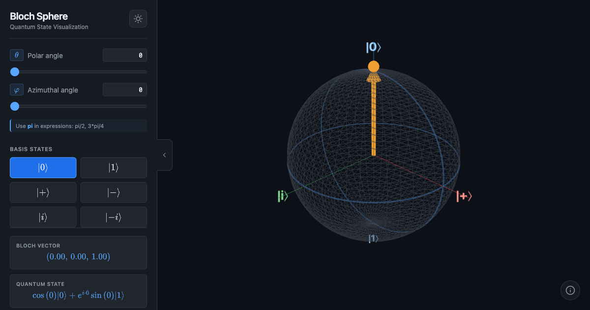

# Bloch Sphere Visualization

An interactive 3D Bloch Sphere for visualizing quantum qubit states.

🔗 **[Live Demo](https://akizumifox.github.io/Bloch-Sphere-Visualization/)**



## Features

- 🎯 **Interactive 3D Visualization** - Rotate and zoom with orbit controls
- 📐 **Adjustable Angles** - Control θ (polar) and φ (azimuthal) angles
- 🔢 **Expression Input** - Enter values like `pi/2`, `3*pi/4`, `2*pi/3`
- ⚡ **Quick Basis States** - One-click access to |0⟩, |1⟩, |+⟩, |−⟩, |i⟩, |−i⟩
- 🌓 **Light/Dark Theme** - Toggle between themes
- 📱 **Responsive Design** - Works on desktop and mobile
- 📊 **Real-time Display** - See Bloch vector coordinates and quantum state
- 🎨 **Color-coded Labels** - Axis labels match their respective colors

## Quantum States

| State | θ | φ | Bloch Vector |
|-------|---|---|--------------|
| \|0⟩ | 0 | 0 | (0, 0, 1) |
| \|1⟩ | π | 0 | (0, 0, -1) |
| \|+⟩ | π/2 | 0 | (1, 0, 0) |
| \|−⟩ | π/2 | π | (-1, 0, 0) |
| \|i⟩ | π/2 | π/2 | (0, 1, 0) |
| \|−i⟩ | π/2 | 3π/2 | (0, -1, 0) |

## Technologies

- [Three.js](https://threejs.org/) - 3D rendering
- [MathJax](https://www.mathjax.org/) - LaTeX math rendering
- Vanilla JavaScript, HTML5, CSS3

## Local Development

1. Clone the repository:
   ```bash
   git clone https://github.com/AkizumiFox/Bloch-Sphere-Visualization.git
   cd Bloch-Sphere-Visualization
   ```

2. Start a local server:
   ```bash
   python3 -m http.server 8080
   ```

3. Open http://localhost:8080 in your browser

## Usage

### Slider Controls
Drag the sliders to adjust θ (0 to π) and φ (0 to 2π) angles.

### Direct Input
Type values directly in the input fields. Supports:
- Numbers: `1.57`, `0.5`
- Pi expressions: `pi`, `pi/2`, `3*pi/4`, `2*pi/3`
- Arithmetic: `pi/4 + 0.1`

### Keyboard Shortcuts
- `Escape` - Close modal

## License

MIT License - feel free to use and modify!

## Author

Made with paws 🐾 by [Akizumi](https://github.com/AkizumiFox) 🦊

---

⭐ Star this repo if you find it useful!

